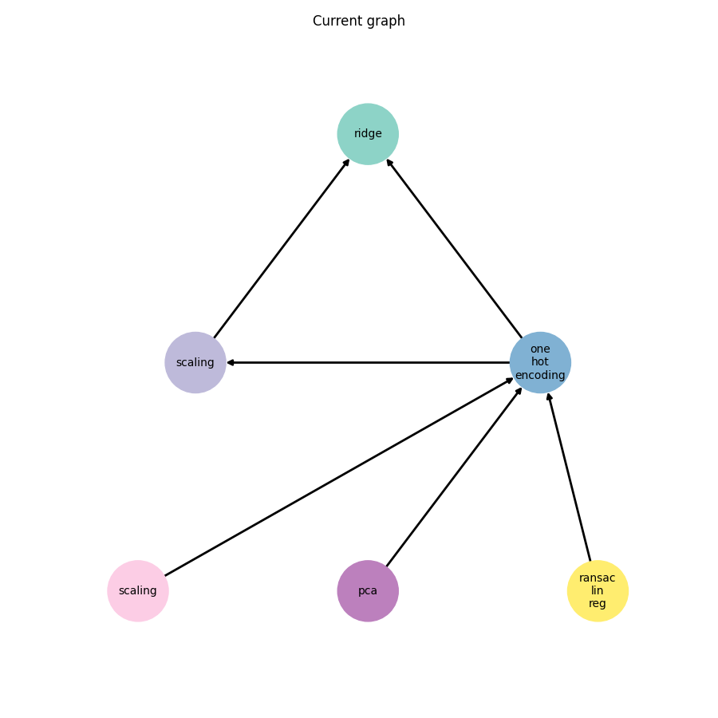

# AIRI-hack
The repository contains the data of the NSS lab team for the hackathon "AIRI Molhack 2022". The task was to predict molecular energy using various molecular data.

Data is available [here](https://www.kaggle.com/competitions/molhack-2022/data). To launch the code just copy files test.db and train.db to airi folder.

[FEDOT](https://github.com/nccr-itmo/FEDOT) framework was used for regression task. MAE was used as a regression metrics.

Final pipeline can be seen below. The team took the third place.
 

